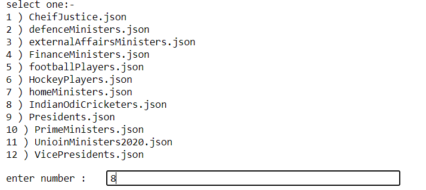
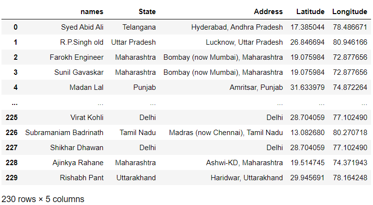
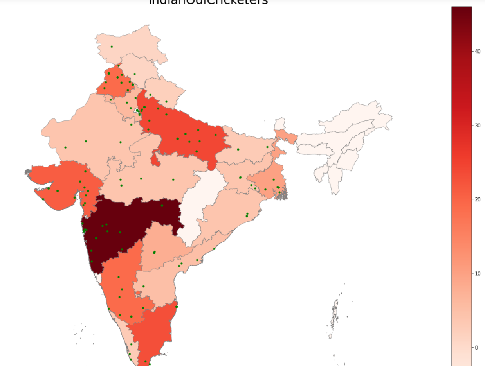
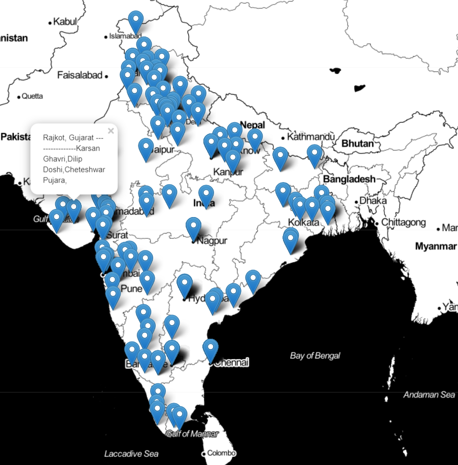
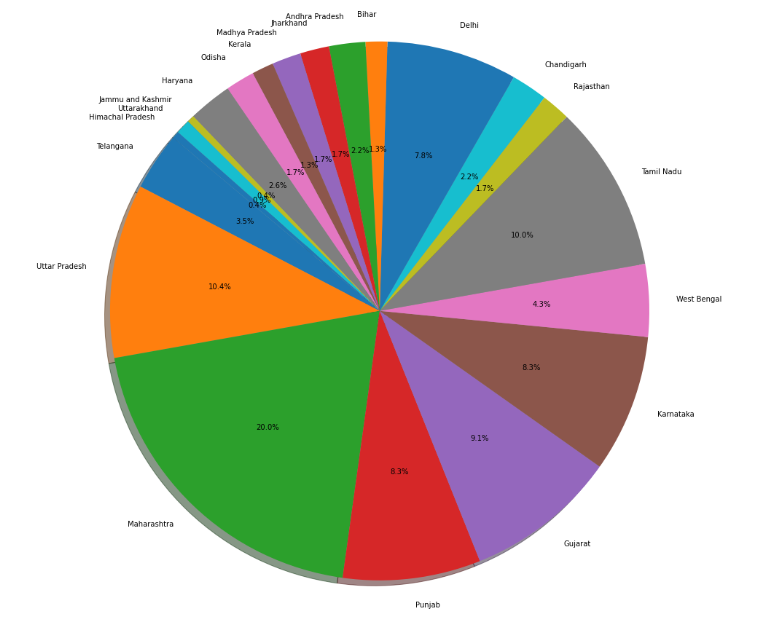
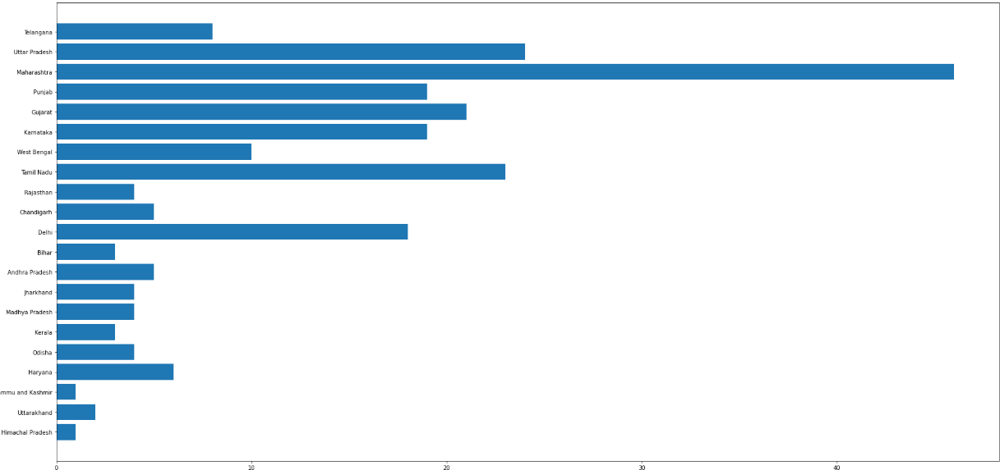

# Where-they-all-from
    Geographic and Statistical visualization for birth places of various famous persons and States contribution for this.
    Program is written to Dynamic as we can change the visualization categories.
## Famous personality's on various categories are included
    1 CheifJustice
    2 defenceMinisters
    3 externalAffairsMinisters
    4 FinanceMinisters
    5 footballPlayers
    6 HockeyPlayers
    7 homeMinisters
    8 IndianOdiCricketers
    9 Presidents
    10 PrimeMinisters
    11 UnioinMinisters2020
    12 VicePresidents

All these data was scraped from Wikipedia using https://github.com/datta07/Wikipedia-Scraper

## Requirements
    Folium
    GeoPandas
    Pandas
    Matplotlib

## How Code runs
    Select a json file you want to explore

     Then the following visualization comes:- 
     View data as DataFrame

     GeoGraphic State wise choropleth map

     Marker Folium Map with popups

    Pie Diagram State wise

    Bar Diagram State wise

## Whats More:-
You can get all these vizualizations for all categories
## NOTE:- All these data was taken from the Wkipedia
